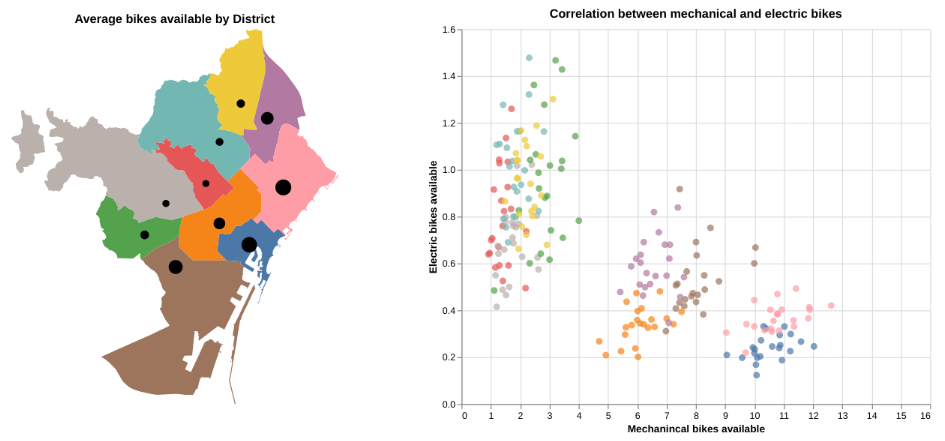
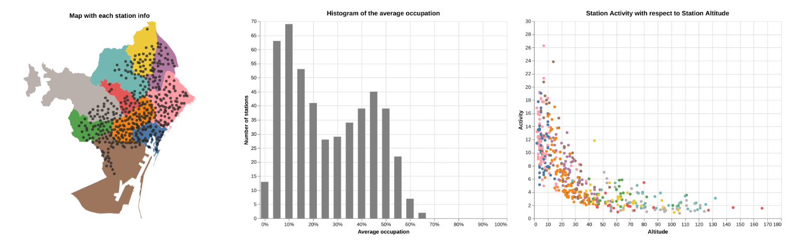

# Bicing Station Service Visualization

A set of Altair charts that visualize the behaviour of the Bicing station service network data from September 2020.

You can check out the result by downloading the file `index.html` and opening it in your browser. Some examples are:

Both of these contain interaction elements only available through the `index.html` file.

The design process for all the charts can be found in the file `AltairChartCreation.ipynb`. This file describes each visualization and its usage along with its design process. If Github doesn't display it correctly download it and open it using Jupyter Notebook.

The data used in this project comes from https://opendata-ajuntament.barcelona.cat/en. 

Authors: Fernando Gastón & Marc Gàllego
